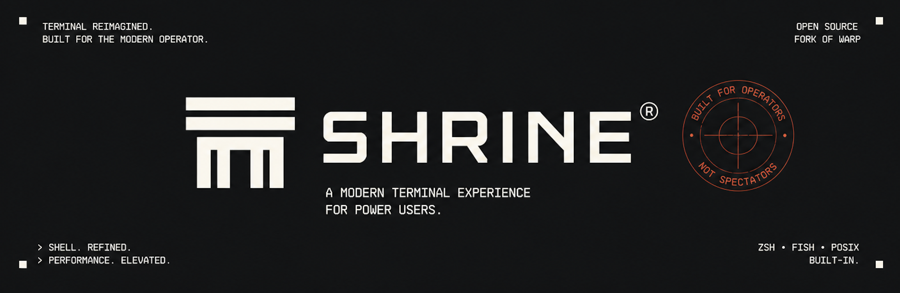

  

# Shrine

Shrine is a modern terminal experience for power users, built from the open-source Warp codebase and shaped around a cleaner, operator-focused workflow.

The project keeps the speed, native feel, shell integration, panes, tabs, and command ergonomics that make Warp useful, while moving the product direction toward Shrine's own identity and defaults.

## Status

Shrine is in active fork development. Expect rapid changes as the app is renamed, cleaned up, and adapted away from upstream Warp branding and services.

## License

Shrine is based on Warp's open-source client. The original licensing still applies: most of the code is AGPL v3, with Warp's UI framework crates licensed under MIT. See `LICENSE-AGPL` and `LICENSE-MIT`.
